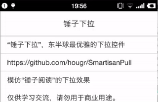
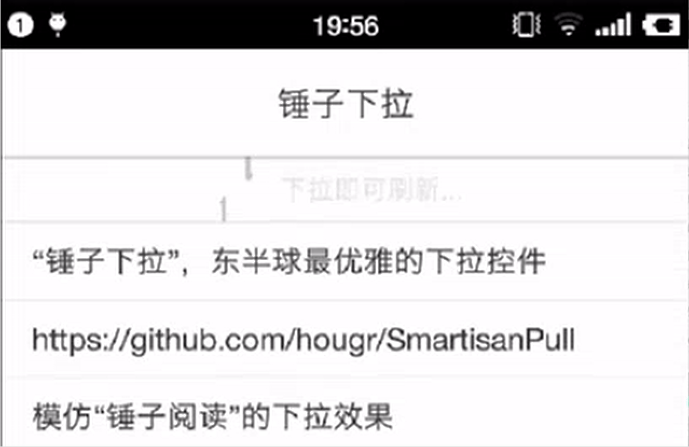
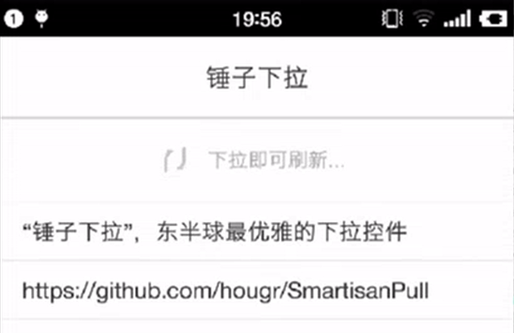
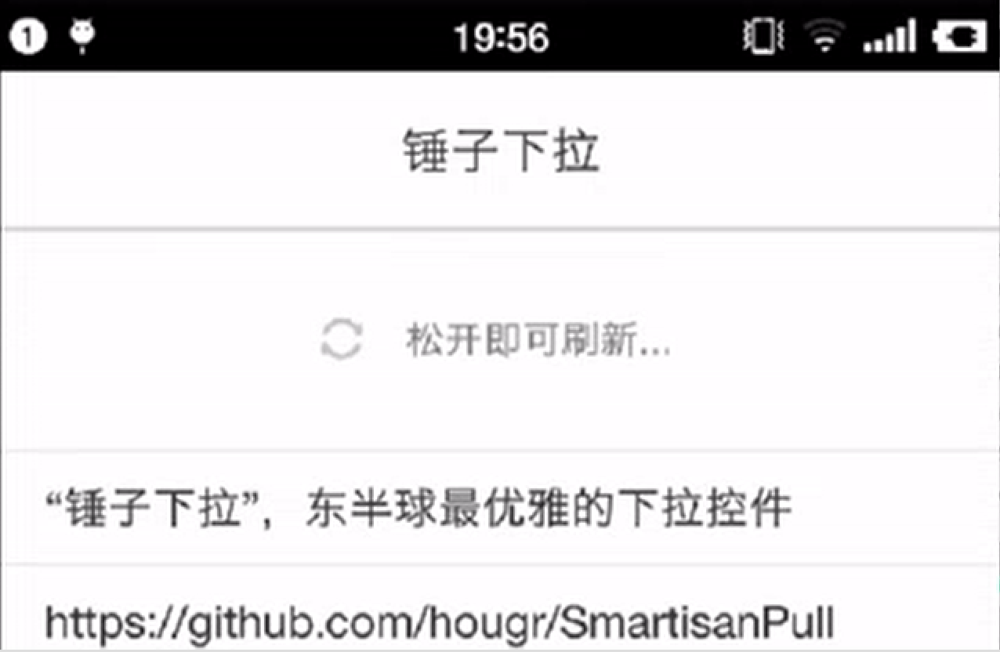
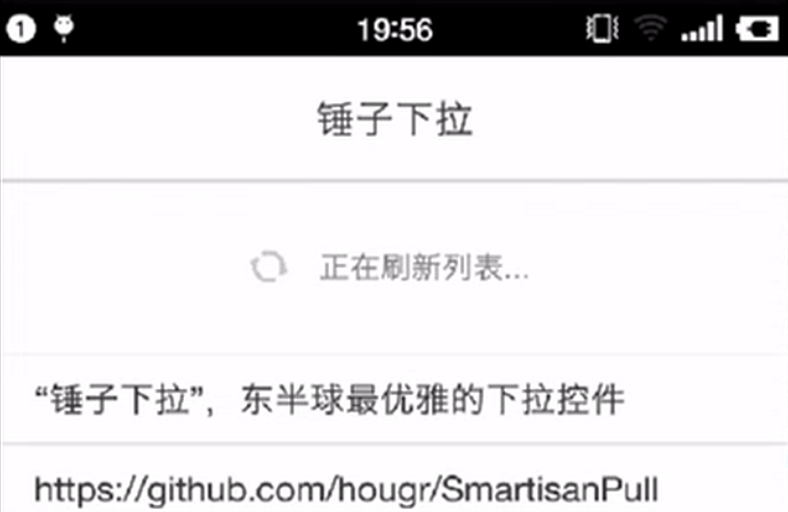
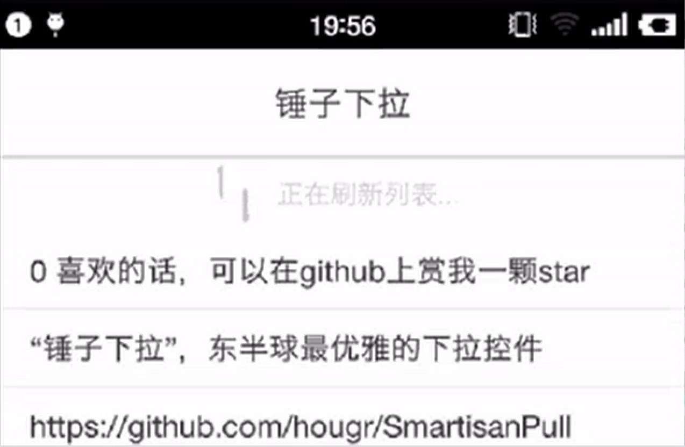

# 锤子下拉

[](https://android-arsenal.com/details/3/4257)

“锤子下拉”，东半球最优雅的下拉控件。（也叫SmartisanRefreshableLayout。）



涉及到的知识点包括：自定义View、自定义ViewGroup、事件分发、属性动画等。

# 说明
本项目模仿“锤子阅读”的下拉效果。仅供学习交流，请勿用于商业用途。

Because the animation in my project imitates the one in Smartisan OS. Only communicate using, please do not used for commercial purposes or illegal purposes, thank you!


# 介绍
下面是我做的过程中，每个阶段有意思的地方：
（下面把“可刷新”的最小距离叫刷新距离）


| 阶段           | 该阶段截图 | 该阶段说明 |
| --------------- | ------------------ | --------------- |
| 刚开始    |  |  下拉时先把item0上面的分隔线滚动出来，该分隔线在下拉过程中一直显示，直到header完全消失，它才重新藏起来。还有，到达刷新距离前，提示语逐渐清晰。另外，在任何阶段，如果手指向上返回，动画逐渐回到原始状态。 |
| 到达刷新距离前    |  |  两线段逐渐过渡为圆弧。 |
| 到达刷新距离时    |  |  两圆弧刚好各转半圈，两圆弧间的两个缺口处于同一水平线。 |
| 到达刷新距离以下    |  |  刷新距离以下，摩擦系数越来越大。但是，两圆弧的旋转始终是平滑的，只有速度变化。 |
| 刷新完成后    |  |  最后，两圆弧逐渐过渡成线段，消失在两端。 |

# 使用

### 首先，在布局文件中使用SmartisanRefreshableLayout

只需在里面加入ListView，仍然保持了ListView的正常使用，不会对它造成什么影响。

```
<com.hougr.smartisanpull.SmartisanRefreshableLayout
     android:id="@+id/refreshable_view"
     android:layout_width="fill_parent"
     android:layout_height="fill_parent" >

     <ListView
         android:id="@+id/list_view"
         android:layout_width="fill_parent"
         android:layout_height="fill_parent"
         android:background="#ffffff"
         android:scrollbars="none" >
     </ListView>
</com.hougr.smartisanpull.SmartisanRefreshableLayout>

```

### 然后，实现下拉事件的监听

```
mSmartisanRefreshableLayout = (SmartisanRefreshableLayout) findViewById(R.id.refreshable_view);
mSmartisanRefreshableLayout.setOnRefreshListener(new SmartisanRefreshableLayout.PullToRefreshListener() {
    @Override
    public void onRefresh() {
        try {
            Thread.sleep(1500);
        } catch (InterruptedException e) {
            e.printStackTrace();
        }
    }
            
    @Override
    public void onRefreshFinished() {
        mSmartisanRefreshableLayout.finishRefreshing();
        mViewHolderAdapter.addToListHead((mRefreshCount++)+" 喜欢的话，可以在github上赏我一颗star");
    }
});
        
```

# 接下来

接下来，会增加对RecyclerView的支持。

# 拜托

喜欢的话，可以点击右上角的star。感谢。

# License 代码版权

    The MIT License (MIT)

    Copyright (c) 2016 hougr

    Permission is hereby granted, free of charge, to any person obtaining a copy
    of this software and associated documentation files (the "Software"), to deal
    in the Software without restriction, including without limitation the rights
    to use, copy, modify, merge, publish, distribute, sublicense, and/or sell
    copies of the Software, and to permit persons to whom the Software is
    furnished to do so, subject to the following conditions:

    The above copyright notice and this permission notice shall be included in all
    copies or substantial portions of the Software.

    THE SOFTWARE IS PROVIDED "AS IS", WITHOUT WARRANTY OF ANY KIND, EXPRESS OR
    IMPLIED, INCLUDING BUT NOT LIMITED TO THE WARRANTIES OF MERCHANTABILITY,
    FITNESS FOR A PARTICULAR PURPOSE AND NONINFRINGEMENT. IN NO EVENT SHALL THE
    AUTHORS OR COPYRIGHT HOLDERS BE LIABLE FOR ANY CLAIM, DAMAGES OR OTHER
    LIABILITY, WHETHER IN AN ACTION OF CONTRACT, TORT OR OTHERWISE, ARISING FROM,
    OUT OF OR IN CONNECTION WITH THE SOFTWARE OR THE USE OR OTHER DEALINGS IN THE
    SOFTWARE.
